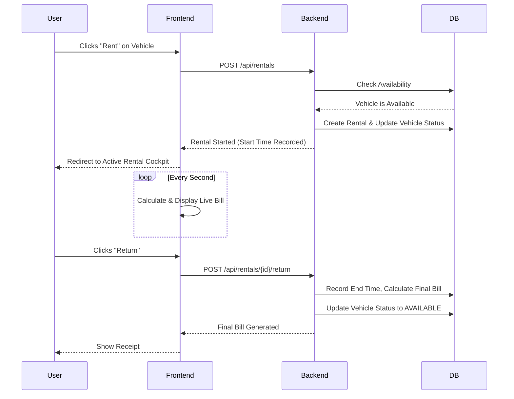

<div align="center">
  <h1>🚗 RentWheels</h1>
  <p><strong>A full-stack, time-based vehicle rental platform</strong></p>
  
  <p>
    
    
    
    
  </p>
</div>

---

## 🌟 Overview

**RentWheels** is a full-stack web application designed for renting cars and bikes. It features a unique **time-based billing system**: users are billed per minute based on the exact duration they kept the vehicle. 

The backend is completely authoritative, ensuring secure and precise billing calculations, while the frontend provides a sleek, live-updating rental cockpit.

<details>
<summary><strong>✨ Key Features (Click to Expand)</strong></summary>

- ⏱️ **Live Time-Based Billing:** See your estimated bill tick up in real-time as you rent.
- 🚙 **Dynamic Fleet Management:** Rent cars or bikes, each with unique attributes (seats, fuel type, engine capacity).
- 🔄 **Real-Time Availability:** Vehicles instantly become unavailable when rented and available again upon return.
- 📊 **Rental History:** Track past rentals, durations, and final billing amounts.
- 🛡️ **Robust Error Handling:** Custom exceptions and a global exception handler for clean API responses.
</details>

---

## 🛠️ Technology Stack

| Layer | Technology | Description |
| :--- | :--- | :--- |
| **Backend** | Java 21, Spring Boot | REST APIs, business logic, billing calculations |
| **Database** | MongoDB Atlas | Cloud-hosted NoSQL database |
| **Frontend** | HTML5, CSS3, Vanilla JS | No-framework, lightweight frontend client |
| **Build Tool**| Maven | Dependency management and build lifecycle |

---

## 📐 Architecture & Flow

### System Architecture

```mermaid
graph TD
    Client[Frontend (HTML/CSS/JS)]
    API[Spring Boot REST API]
    Controller[Controller Layer]
    Service[Service Layer]
    Repo[Repository Layer]
    DB[(MongoDB Atlas)]

    Client <-->|HTTP JSON| API
    API <--> Controller
    Controller <--> Service
    Service <--> Repo
    Repo <--> DB
```

### Rental Lifecycle



---

## 🚀 Getting Started (Local Development)

### Prerequisites

- **Java 21** installed
- **Maven** installed
- **MongoDB Atlas** account (or local MongoDB)

### 1. Clone the Repository

```bash
git clone https://github.com/prince585/Rent-A-Wheel.git
cd Rent-A-Wheel
```

### 2. Configure the Backend

1. Navigate to the backend directory:
   ```bash
   cd vehicle-rental-backend/rentedVehicle
   ```
2. Copy the `.env.example` file to create your local config (or set environment variables):
   ```bash
   # Set MONGODB_URI in your environment or application.properties
   ```
3. Update `src/main/resources/application.properties` with your MongoDB credentials:
   ```properties
   spring.data.mongodb.uri=mongodb+srv://<username>:<password>@<cluster>.mongodb.net/?appName=rentwheels
   ```

### 3. Run the Backend

```bash
./mvnw spring-boot:run
```
The backend API will start on `http://localhost:8080`.

### 4. Run the Frontend

Since it's vanilla HTML/CSS/JS, you can simply open the frontend files in your browser or use a live server extension (e.g., VS Code Live Server).
1. Navigate to the frontend directory:
   ```bash
   cd ../../vehicle-rental-frontend
   ```
2. Open `index.html` in your browser.

---

## 📖 API Reference

Here are the core REST endpoints available in the system:

### Vehicles
- `GET /api/vehicles/available` - Get all available vehicles
- `GET /api/vehicles/{id}` - Get vehicle details

### Rentals
- `POST /api/rentals` - Rent a vehicle
- `POST /api/rentals/{id}/return` - Return a rented vehicle and generate bill
- `GET /api/rentals/{id}/current-bill` - Get live estimated bill for an active rental

### Users
- `GET /api/users/{id}/rentals` - Get rental history for a user

---

## 🌐 Deployment

For complete instructions on deploying the backend to **Render** and the frontend to **Vercel/Netlify**, please refer to our detailed [Deployment Guide](DEPLOYMENT.md).

---

<div align="center">
  <i>Built with ❤️ using Java & Spring Boot</i>
</div>
